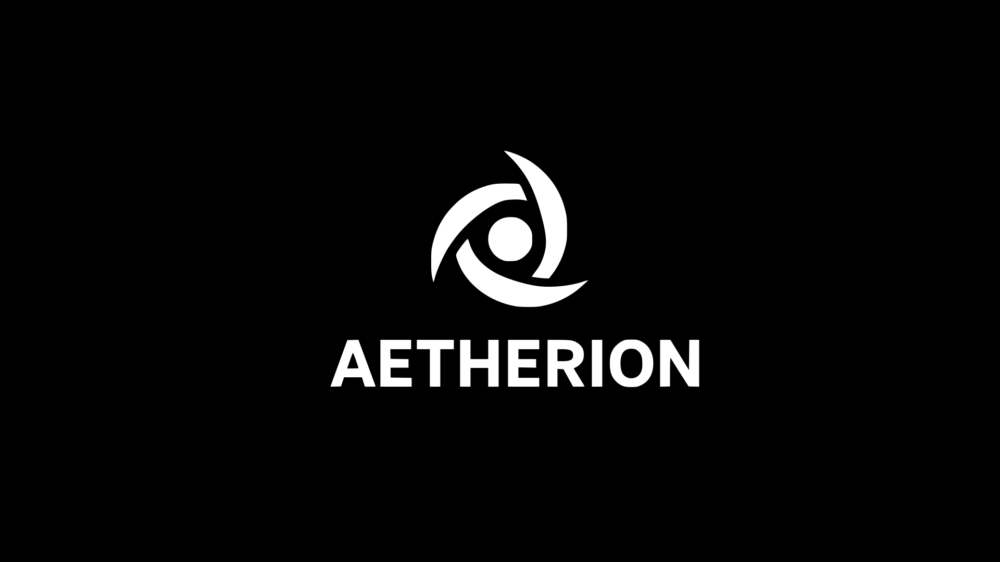
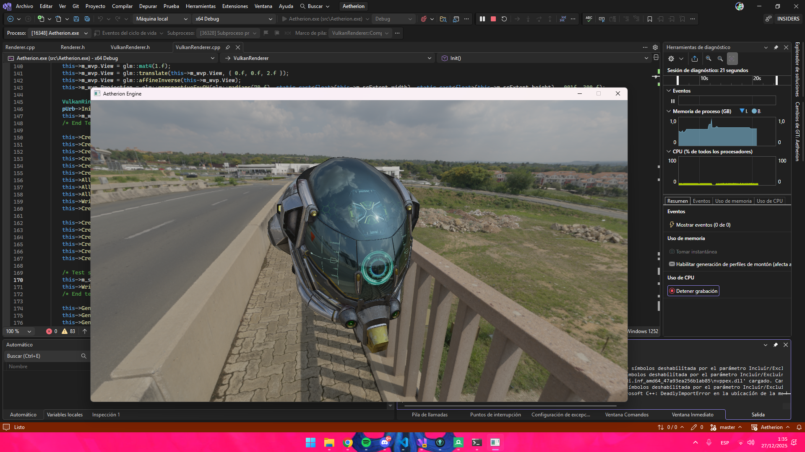

# Aetherion
- Aetherion Game engine source code

## Description
- Aetherion is a game engine made in C++ and Vulkan (and soon DirectX 12) by Dravix Studios
- Was made for having a propietary next-gen game engine
- It's actually under development. May have issues that need to be solved.

## Features
- Deferred rendering
- PBR
- Image Based Lighting
- Domain Driven Design 🚧 **Developing at** [refactor/domain-driven-design](https://github.com/DravixStudios/Aetherion/tree/refactor/domain-driven-design)
- Indirect Drawing ❌
- Disney BRDF ❌
- C# Scripting system ❌
- GUI ❌
- Project management ❌
- More soon!

## Current Screenshot

# LICENSE
- Read [LICENSE](./LICENSE)

# Third-Party
- [Assimp](https://github.com/assimp/assimp)
- [spdlog](https://github.com/gabime/spdlog)
- [shaderc](https://github.com/google/shaderc)
- [g-truc/glm](https://github.com/g-truc/glm)
- [Vulkan](https://www.vulkan.org/)
- [STB](https://github.com/nothings/stb)
- [miniz](https://github.com/richgel999/miniz)
- [tinyexr](https://github.com/syoyo/tinyexr)
- [SPIRV-Cross](https://github.com/KhronosGroup/SPIRV-Cross)
